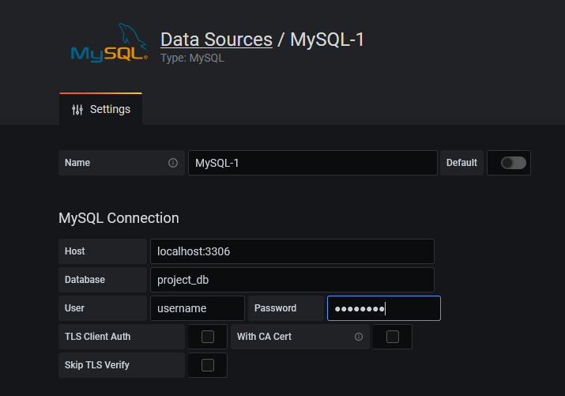
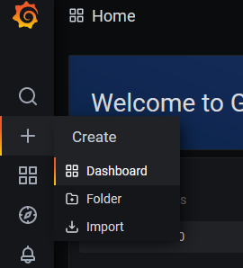

# ESP32toMySQL
This project provide instructions and code examples to push datas from esp32 to grafana server using php and mysql.

## HARDWARE REQUIREMENTS
* Linux Server
    * Any linux computer on your own WiFi
    * You can also rent a VPS
* ESP32
    * Any ESP32 eval board with WiFi antenna

## SERVER SETUP INSTRUCTIONS
To push datas to grafana server, you must got a linux server available, with differents services enabled.  
Instructions are written for linux debian OS (debian, ubuntu, raspbian, ...), but you can adapt them with your own linux OS.  
**Project is tested with Raspberry Pi 4, 4Go RAM, ubuntu-server OS.**

There is the list of services required (LAMP server + Grafana). If you already have one of them, you can directly go to next point.
* [Apache2 server](setup/setup_apache2.md)
    * Used to listening to 80 port.
* [MySQL](setup/setup_mysql.md)
    * Used to save datas, and send them to Grafana.
* [PHP](setup/setup_php.md)
    * Used to catch ESP32 datas on 80 port and add them to MySQL database.
* [Grafana](setup/setup_grafana.md) (optional)
    * Used to display datas on web browser.

## CODES EXAMPLES
Now, your server is correctly setup, you can use it to catch esp32 datas and display them on grafana.

### SETUP MYSQL
#### Create new databse and user
```
sudo mysql -u root
mysql> CREATE DATABASE project_db;
mysql> CREATE USER 'username'@'localhost' IDENTIFIED BY 'password';
mysql> GRANT ALL PRIVILEGES ON project_db.* TO 'username'@'localhost'
mysql> QUIT;
```
#### Create data table
On php myadmin `http://your.ip.adress/phpmyadmin` :
* Sign in with the new account
* On the left panel, click on project_db
* Click on new table
* Specify your data types, names, allow or not null value. One of them must be a number, and be specify as PIMARY KEY. The PRIMARY KEY can't have 2 times the same value. Some of your values can be auto-increment, it is recommend to auto-increment the PRIMARY KEY.
* Save your table

### PHP SCRIPT
An example php script is provided [here](php_example.php).  
You must copy this file on your server at `/var/www/html/`.

### ESP32 EXAMPLE
An example esp32 code is provided [here](esp32_example.cpp)

### GRAFANA
Log in on your grafana admin account at `http://your.server.ip:3000`.
* Connect your database
    * Settings
    * Data Sources
    * Add data source
    * MySQL



* Create a new dashboard



* Click on add panel
    * Here you can choose pabel type. To choose wich data to display, in the panel settings, choose the right database, table, and data.
